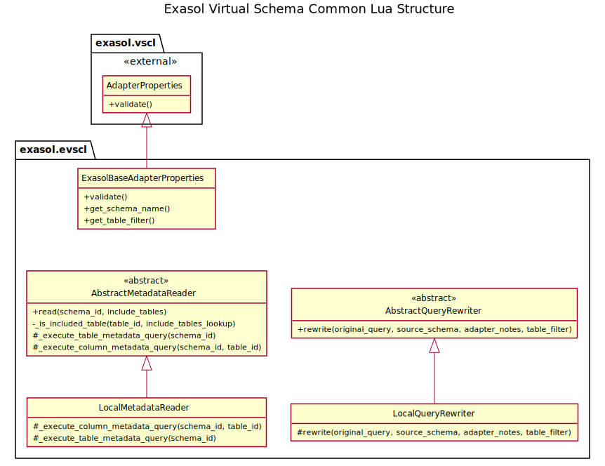

# Exasol Virtual Schema Common Lua

This is a common library of the Lua-based Exasol Virtual Schema and Row-Level-Security.

It is the middle layer of the two Virtual Schemas.

<table>
    <thead>
        <tr><th>Layer</th><th colspan="2">Module</th></tr>
    </thead>
    <tbody>
        <tr>
            <th>3</th>
            <td><a href="https://github.com/exasol/exasol-virtual-schema-lua">Exasol Virtual Schema (Lua)</a></td>
            <td><a href="https://github.com/exasol/row-level-security-lua">Row-level Security (Lua)</a></td>
        </tr>
        <tr><th>2</th><td colspan="2">Exasol Virtual Schema Common Lua (this library)</td></tr>
        <tr>
            <th>1</th>
            <td colspan="2">
                <a href="https://github.com/exasol/virtual-schema-commmon-lua">Virtual Schema Lua</a>
            </td>
        </tr>
  </tbody>
</table>

## Information for Users

This is a base library required to build the actual Virtual Schemas. If you plan to use the software in Exasol, please
check the respective repositories.

* [Exasol Virtual Schema (Lua)](https://github.com/exasol/exasol-virtual-schema-lua)
* [Row-level Security (Lua)](https://github.com/exasol/row-level-security-lua)

## Information for Developers

* [Changelog](doc/changes/changelog.md)
<!-- TODO: Add API documentation link after first merge to main, so that the link checker does not complain. -->

### Structure

The library consists of a couple of base classes that Virtual Schemas need that use the Exasol database as a _data source_.

Note that you only find implementations for _local_ reading of metadata and query rewriting here. The reason for this is that remote access is only relevant for the [Exasol Virtual Schema for Lua](https://github.com/exasol/exasol-virtual-schema-lua) and therefore not a common part.
